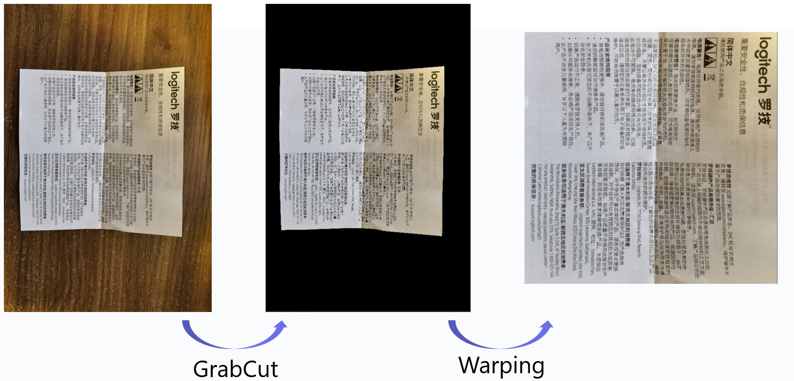
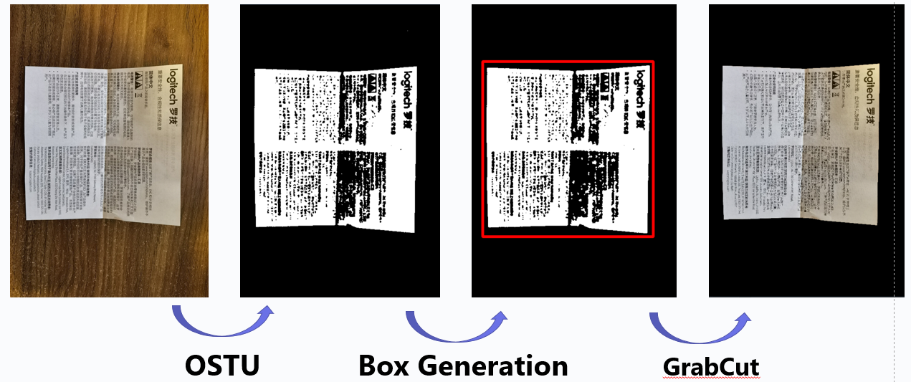
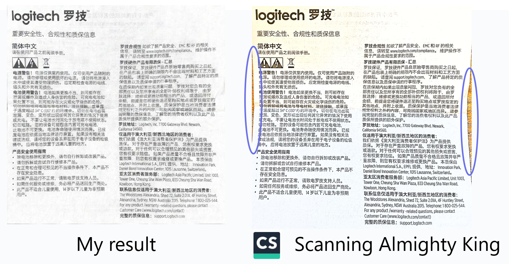
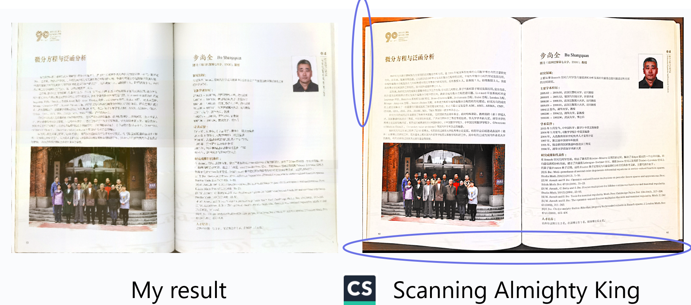

# text-scanner
An automatic scanner with grabcut + warping.

### 0. Environment
- Windows 10
- Visual studio 2019(Release x64)
- OpenCV + Eigen + OpenMP
### 1. Pipeline
I first use the 'GrabCut' to segment the image, then use warping operation to resize it into a rectangle shape.

### 2. Automatic GrabCut
In our real life, the scanner dosen't need the interaction like grabcut, so I designed an automatic grabcut which can generate the rectangle box automatically.

### 3. Results
I add a function which can remove the shadow, and I compare my results with an APP on Android called 'Scanning Almighty King'.

